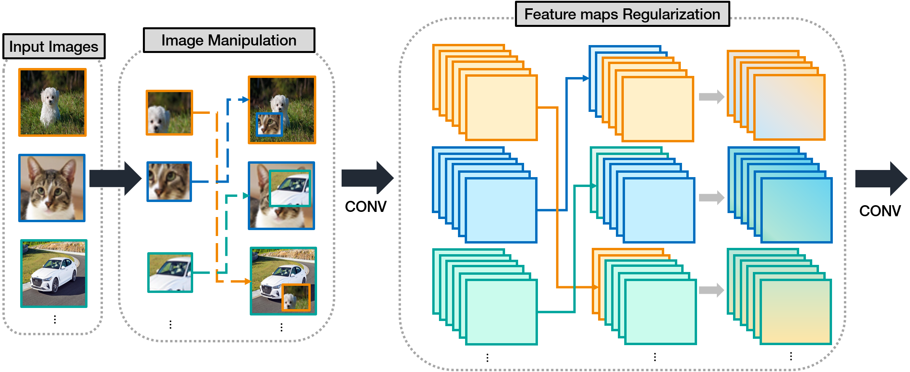

# Regularization method

## Regional Patch-Based FeatureInterpolation Method for EffectiveRegularization
- [Paper link](https://ieeexplore.ieee.org/document/9000503) This paper has been published in IEEE access.
- Deep Convolutional Neural Networks (CNNs) can be overly dependent on training data, causing a generalization problem in which trained models may not predict real-world datasets.
- Propose a regularization method that applies both image manipulation and feature map regularization based on patches.
- In the image manipulation stage, two images can be combined, based on the patch to generate a new image without information loss.
- we added patch-based other image features through interpolation between feature maps of new images in the feature map regularization stage.
- This allows the model to simultaneously learn the image distribution of other labels and to generate a model robust to noise



## Getting Started
### Requirements
* python3.6
* PyTorch
* Dataset (CIFAR10, 100 & TinyImageNet)

### Train

```
python train.py 
```

### Test

```
python test.py
```

